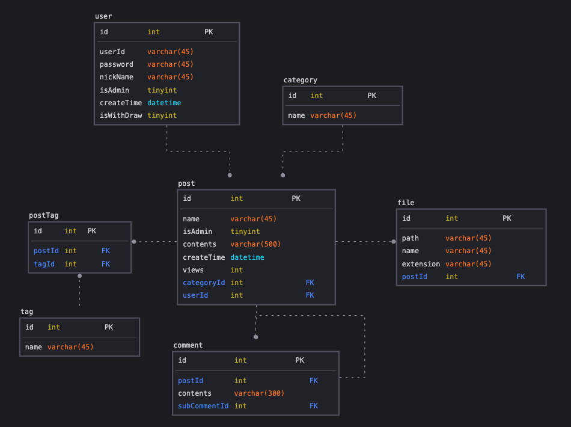
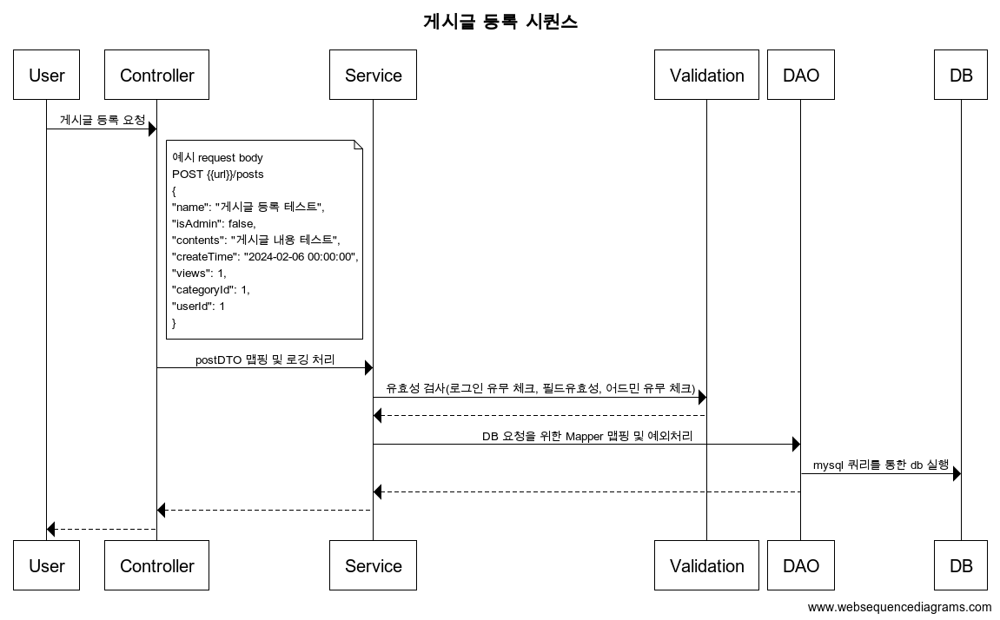
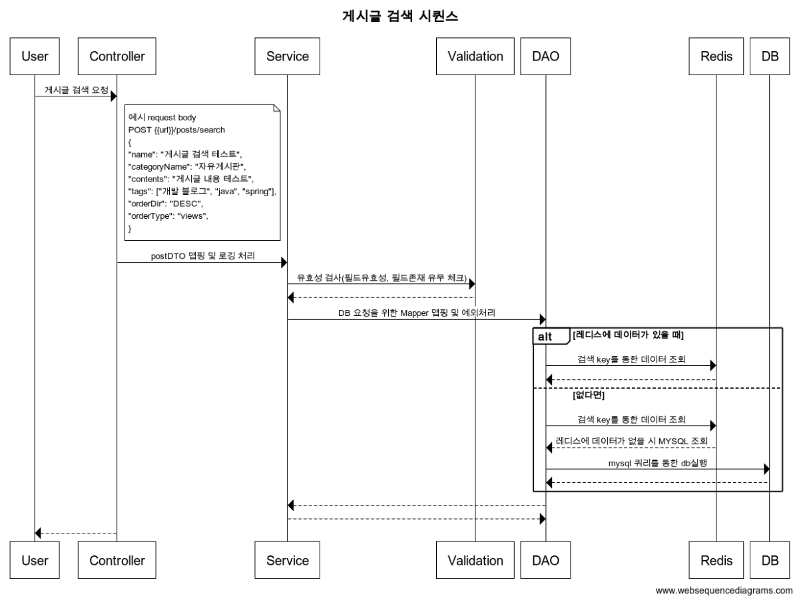

# Board Server

> 대용량 트래픽을 감당할 수 있는 게시판 프로젝트입니다. (초당 1000 tps 이상의 게시글 검색 API)
> 모니터링 및 트러블 슈팅 전략 확인
> 젠킨스를 활용해 CD 구성

## 사용 기술

- Language: JAVA 17
- Framework: Spring Boot 3.2.2
- DB: MySQL (MyBatis), Redis

## 프로그램 주요 기능

- [ ] 회원
  - [ ] 가입, 탈퇴
  - [ ] 아이디 및 닉네임 중복체크
  - [ ] 비밀번호 암호화
  - [ ] 로그인, 로그아웃
- [ ] 게시판
  - [ ] 카테고리 관리
    - [ ] 추가, 삭제, 수정
  - [ ] 게시글 관리
    - [ ] 게시글 & 파일 추가, 삭제, 수정, 조회
    - [ ] 유저 정보, 게시글 제목, 게시글 내용 등
  - [ ] 게시글 검색 기능
    - [ ] 작성 유정 아이디
    - [ ] 게시글 제목, 게시글 내용 등을 통해 검색
    - [ ] 태그 작성 및 조회 기능
  - [ ] 댓글 작성 기능
- [ ] 어드민
  - [ ] 공지글 추가 기능

## ERD

## 시퀀스

게시글 등록 시퀀스

게시글 검색 시퀀스

## 아키텍처

`추후에 업로드 예정...`
