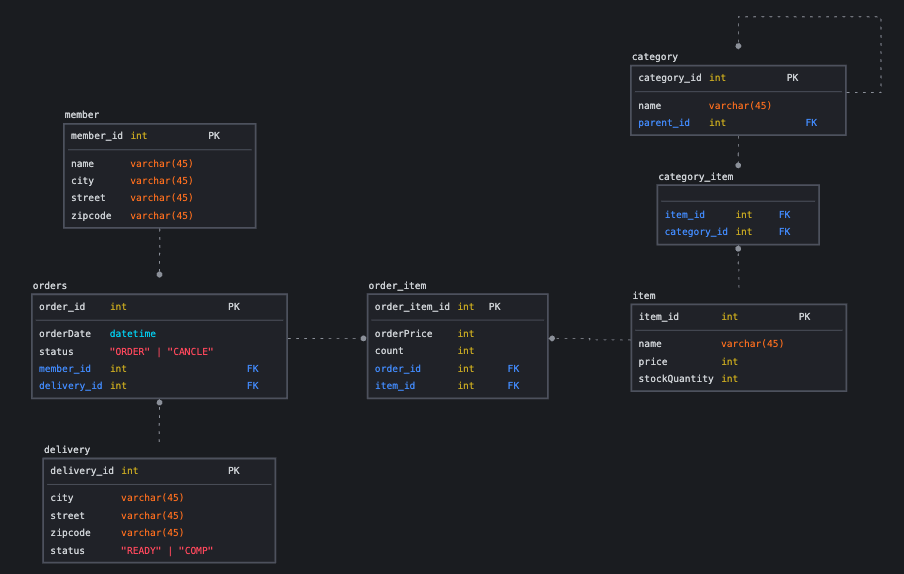

## JPA Shop

### 의존성

- Framework: Spring Boot 3.2.2
- Language: Java 17
- DB, ORM: H2, JPA(Hybernate)
- WEB: Thymeleaf 
- Test: Spring-Test(Junit5, assertj)
- ETC: Lombok, Spring-Boot(Validation, devtools)

### 기능

- 회원
  - 회원 등록
  - 회원 조회
- 상품
  - 상품 등록
  - 상품 수정
  - 상품 조회
- 주문
  - 상품 주문
  - 주문 내역 조회
  - 주문 취소
- 기타 요구사항
  - 상품은 재고 관리가 필요하다
  - 상품의 종류는 도서, 음반, 영화가 있다.
  - 상품을 카테고리로 구분할 수 있다.
  - 상품 주문 시 배송 정보를 입력할 수 있다.

### Table

### 기록

- 외래 키가 있는 곳을 연관관계의 주인으로 정한다.
  - 연관관계의 주인은 비즈니스 상에 우위에 있는 것이 아니고 외래키를 누가 관리하느냐의 문제이다.
- `Getter`는 열어두고 `Setter`는 닫혀있어야 한다.
  - 엔티티와 같은 경우 `Setter`를 열어두기보다는 따로 메서드를 선언하여 해당 메서드를 통해서만 생성될 수 있도록 하는 것이 좋다.
- `@ManyToMany`는 사용하지 말자. 중간 테이블의 값을 설정할 수 없고, 세밀한 쿼리를 실행하기 어렵다. `@ManyToOne`, `@OneToMany`로 매핑하자.
- `@XxxToOne`인 관계의 fetch 타입은 항상 `LAZY`로 설정해야 한다.
  - `EAGER`일 경우 예측이 어렵고 N+1 문제가 발생하기도 하고, 최악의 경우 관계가 있는 모든 테이블을 조회하는 경우가 생길 수 있다.
  - 연관된 엔티티 조회 시 fetch join 또는 엔티티 그래프 기능을 사용하자
- Cascade 옵션을 통해 한 엔티티가 받은 영향이 관계된 엔티티에도 퍼질 수 있도록 한다.
- 컬렉션은 필드에서 바로 초기화 해주어야 안전하다.
- ENUM 타입을 Entity 내에서 사용할 경우 `EnumType.STRING`을 선언해주어야 한다.
- `@Embeddable`의 기본 생성자를 protected로 열어두어야 JPA 구현 라이브러리가 객체를 생성할 때 리플랙션과 같은 기술을 사용할 수 있도록 지원할 수 있다.
- 다른 Entity와 관계를 맺고 있는 Entity는 연관관계 메서드를 선언해줌으로써 관계 주입 시 동시에 양방향에 넣어줄 수 있도록 해준다.
  - 연관관계 메서드의 위치는 좀 더 관계를 주도하는 쪽에 넣어주는 것이 좋다.
- Service가 DB에 접근한다면 `@Transactional`을 통해 하나의 트랜잭션 안에서 실행되도록 한다.
  - `readonly = true` 를 설정해주면 읽기 전용으로 더티체크와 같은 영속성 컨텍스트가 할 일이 줄어 약간의 성능이 향사된다.
  - 사실 조회 관련 서비스가 더 많기 때문에 전체적으로 `readonly = true`를 선언하고 삽입, 수정, 삭제 등에 따로 @Transactional을 선언해주자
- test에 application.yml을 따로 선언해주면 test는 해당 설정을 따라간다.
  - H2 DB의 기본 설정이 없을 경우 메모리 DB 방식으로 운영된다.
- 엔티티에 필요한 대부분의 로직은 엔티티 내부에 있고, 서비스 계층은 단순히 엔티티에 필요한 요청을 위임하는 역할을 한다. (도메인 모델 패턴)
  - [도메인 모델 패턴](http://martinfowler.com/eaaCatalog/domainModel.html)
  - [트랜잭션 스크립트 패턴](http://martinfowler.com/eaaCatalog/transactionScript.html)
- 클라이언트로부터 전달받은 객체는 Entity와 별개로 dto로 따로 정의해주는 것이 좋다.
  - 엔티티 내부에 화면에 처리하기 위한 기능이 많아진다면 유지보수가 어려워진다.
  - 엔티티에는 핵심 로직만 가지고 있도록 하고, dto를 활용해 화면이나 API 요구사항을 처리하도록 하자
- 영속성 컨텍스트가 관리하지 않는 준영속 컨텍스트는 merge로 수정하지 말자
  - merge를 통해 수정할 경우 영속 엔티티의 값을 준영속 엔티티의 값으로 모두 바꾸어버린다.
  - 그러므로 원하는 영속 엔티티를 우선 조회한 뒤 원하는 값만 수정해주어서 영속성 컨텍스트가 더티 체킹으로 이를 알아서 수정하고 DB에 넣어주도록 하자.
    - 컨트롤러에서 어설프게 엔티티를 생성하지 말자.
    - 트랜잭션이 있는 서비스 계층에 식별자(id)와 변경할 데이터를 명확하게 전달
    - 트랜잭션이 있는 서비스 계층에서 영속 상태의 엔티티를 조회, 엔티티 데이터를 직접 변경
    - 트랜잭션 커밋 시점에 변경 감지가 실행된다.

---

# 실전! 스프링 부트와 JPA 활용2 - API 개발과 성능 최적화

## 섹션 1

엔티티를 RequestBody, ResponseBody에 활용할 경우 문제점

- 엔티티에 프레젠테이션 계층을 위한 로직이 추가된다. (validation 관련 로직 등등)
- 다양한 API와 관련된 로직들이 엔티티에 담기게 된다.
- 엔티티가 변경되면 API 스펙이 변경된다.

-> API 요청 스펙에 맞추어 별도의 DTO를 만드는 것이 좋다.

DTO 활용

- 엔티티와 프레젠테이션 계층을 위한 로직이 분리된다.
- 엔티티를 그대로 노출시키지 않아 API 스펙과 분리할 수 있다.
- 엔티티가 변해도 API 스펙은 변하지 않는다.

컬렉션 반환 시 문제점

- API 스펙을 변경하기 어렵다.

-> 별도의 클래스를 통해 object 형식으로 반환되어야지만 api 스펙 변화에 유연하게 대처할 수 있다.

